# BatteryProbe.ai

Predicting SoC (State of Charge) profiles of lithium ion batteries is not a difficult task. Every laptop or smartphone has a built-in feature that does that with a relatively good accuracy.
These profiles look generally like this:
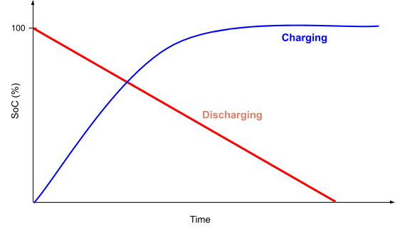

But, as Ubuntu's official documentation says :
> When you check the remaining battery life, you may find that the time remaining that it reports is different to how long the battery actually lasts. This is because the amount of remaining battery life can only be estimated. Normally, the estimates improve over time.
>
> Another factor is how the battery discharges. Some batteries lose charge faster the emptier they get. Without precise knowledge of how the battery discharges, only a rough estimate of remaining battery life can be made.
>
> As the battery discharges, the power manager will figure out its discharge properties and will learn how to make better estimates of battery life. They will never be completely accurate, though.

Furthermore, these profiles are valid under the assumption that power drawn from the battery is constant over time. Which is not always true if a user switches between heavy tasks (video rendering, streaming, multicore tasks, etc) and more “regular” ones (browsing the internet, listening to music, etc)

BatteryProbe.ai offers an alternative to the built-in SoC estimator. It uses a neural network to accurately predict charging/discharging profiles.

## Data
The data is downloaded from an InfluxDB server. To see how the data collection works, you can have a look at [BatteryProbe.collect](https://github.com/iamodog/BatteryProbe.collect)

You can either install your own server for data collection using the previous git repository.

Or you can use our existing server and install a scraping agent on you local machine to send data. In this case, you will obtain access to our data, as well as yours. You can contact @khazit or @iamodog for more information.


Either way, you can download the dataset with the bash script in `utils`:
```
$ bash utils/download.sh [IP_INFLUXDB] [PORT_INFLUXDB]
```

## Goal
**Definition:**
> For a sequence of **p** observations from the past, predict the remaining sequence of **f** observations until a given condition is met.

We extract charging and discharging sessions from our dataset, then split each one at a given point (see [section about progressive training](#progressive-training)) to constitue our inputs and targets.

A basic baseline for our goal would be to use a linear projection to predict the remainder of the SoC profile:
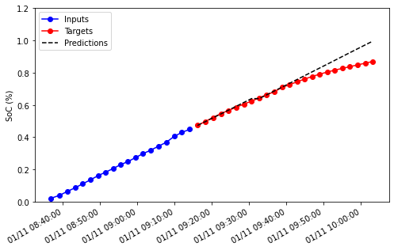

A L1 loss is used to evaluate our outputs.

## AutoRegressive architecture
In a production environment, we’d want to output sequences of variable length. More precisely, we’d like to predict the SoC (state of charge) profile until it reaches 0% when discharging, or 100% when charging.
Using an Autoregressive RNN allows us this kind of flexibility.

A forward pass consist of two phases:
  * A warm-up, that use past (`t-1`, `t-2`, …) and current (`t`) data to predict the first future step (`t+1`)
  * And then a loop that uses (`t+1`) output as an input to predict (`t+2`) and so on until a given condition is met (based on SoC value).

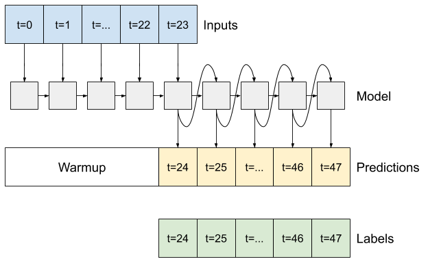
<p align="justify">
  Source: https://www.tensorflow.org/tutorials/structured_data/time_series
</p>

## Distinction between context and features
Among the data that is used as our models input, it's important to make a distinction between context and features.

Context is all the columns that give context to our predictions. They are fixed in time so there is no need to predict them in our AutoRegressive architecture. Context could be the type of OS, some intrinsic information about the battery or wether it is plugged in or not.

Features are what's left, and represent variables that should be predicted in a forward pass.

## Time2Vec
In time series forecasting, one of the most important features is time. There are different ways to use a timestamp as an input to a neural network. One of them uses a periodic function to convert a timestamp (in our case, a UNIX epoch) into a more meaningful variable.

The period of this periodic is usually determined manually, either by prior knowledge of the data (e.g: weather data it has daily and yearly periodicity) or by a Fourier analysis of the signal.

We chose here to use a [“model-agnostic vector representation for time”](https://arxiv.org/abs/1907.05321). Instead of choosing a fixed period for our time input, we use learnable parameters to convert our UNIX epoch input into a “time vector”.

## Progressive training
For each session in the dataset, part of it is used as an input, while the other is used as a label (target). The bounds are parameters that defines where this split happens.

### Random bounds
The first way to define these bounds is to choose an upper bound `u` and a lower bound `l`. During training, for each session, a random number between `u` and `l` will be used to split a given session.

### Progressive bounds
When using progressive bounds, the model will learn to predict for a set of given bound gradually, in decreasing order. Bigger bounds (0.8 or 0.9 for example) give small sequences of targets and are thus easier to learn. Smaller ones give longer sequences which are harder to learn.

For a given list of `n` bounds, the training dataset will be divided into `n` datasets, so that the model doesn't see the same sessions times.

If `progressive_bounds = [0.9, 0.7, 0.3]`:
  1. We first train on

  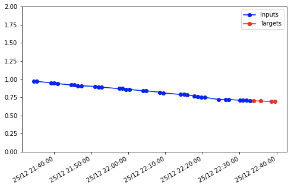

  2. Then

  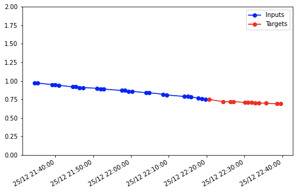

  3. And finally

  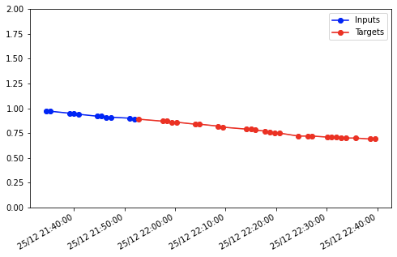

## Uncertainty estimation
We also implemented a way to associate an uncertainty estimate to our predictions. When the flag `use_std` is true in the TOML config file, an Negative Log Likelihood (NLL) loss term is added to the L1 loss.

## Implementation
### Install
All the dependencies are defined by poetry in a `pyproject.toml` file. To install the environment:
```
$ git pull https://github.com/khazit/BatteryProbe.ai.git
$ cd BatteryProbe.ai
$ poetry install
```

### Training
To train a model, a TOML config file is used. The main goal is to ensure reproducibility of the experiments. Once all the parameters are defined (see `params.toml`), a model can be trained using:
```
$ python run_experiments.py [CONFIG_1.toml] ([CONFIG_2.toml] [CONFIG_3.toml] ...)
```

### Results
**Disclaimer:** The data used for the following models is coming from only 3-4 laptops. We believe that results could be much better with a more diverse dataset, and with a bigger scale.

**Model architecture:**

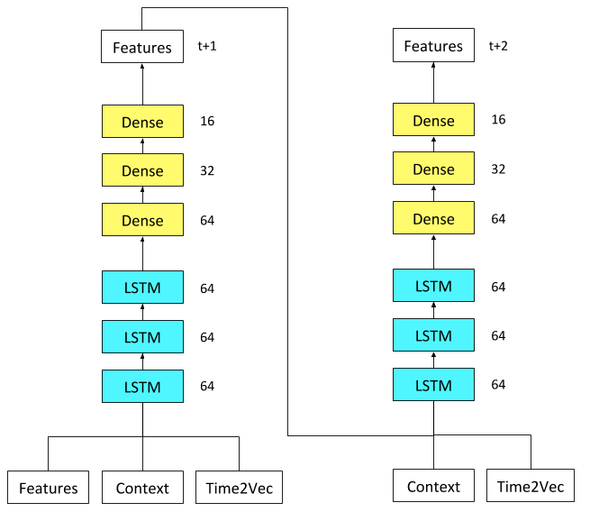

The model was trained on 792 sessions, with random bounds `0.2-0.8`. Sessions were selected based on two thresholds:
  1. Minimum of 10 data points per session
  1. Minimum duration of 10 minutes

The training was scheduled to run for 300 epochs or until the validation loss didn't improve for 30 epochs, whichever comes first. It took 108 epochs, and each sessions was repeat 5 times per epoch thanks to the [random data augmentation](#random-bounds).

Progressive training was not used due to the limited number of sessions.

The following features were used:
  * `capacity`: Battery state of charge (0.0-1.0).
  * `load_average_1`: CPU load average over the last minute.
  * `cpu_temp`: CPU temperature.

Along with the following values for context:
  * `battery_status_*`: Wether the battery is charging or discharging.
  * `os_*`: Type of OS
  * `charge_full_design`: Battery full charge by design.

The results showed a significant improvement over the [baseline](#goal) :
|           | Baseline | AutoRegressive |
|-----------|----------|----------------|
| NLL + L1  | 12.73    | **5.56**       |


Some examples of good predictions:

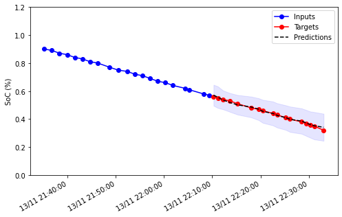

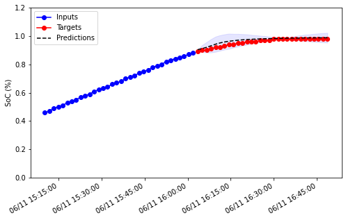

And some bad ones:

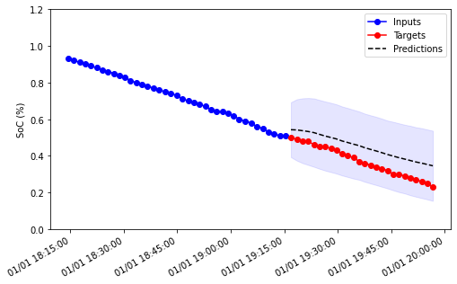

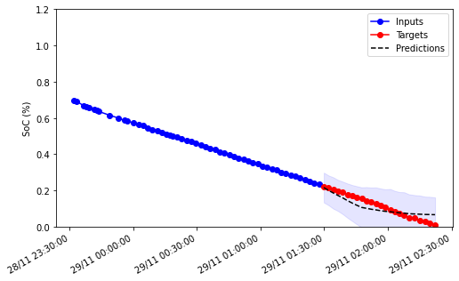

## Conclusion

This method shows encouraging results, which could be even better by working on the following ideas:
  * Better weighting the L1 and NLL terms in the loss.
  * More diverse data at a bigger scale.